# 🚀 Kevin Isom | Full-Stack Architect, Venture Studio Builder & Innovation Catalyst

<div align="center">

[](https://git.io/typing-svg)
<br /> <br />

[](https://github.com/isomkevin)

</div>

---

## 🎯 About Me

```typescript
const kevin = {
    location: "Nairobi, Kenya 🇰🇪",
    company: "LESOM Dynamics (Founder)",
    currentFocus: ["Tech Business Development","Rust", "AI/ML", "Blockchain", "Cloud Architecture"],
    philosophy: "Start Local, Think Global 🌍",
    code: ["JavaScript", "Python", "TypeScript", "Rust"],
    architecture: ["Microservices", "Event-Driven", "Serverless"],
    databases: ["MongoDB", "PostgreSQL", "Redis", "Firebase", "SupaBase"],
    currentlyLearning: "Advanced AI & Blockchain Integration",
    askMeAbout: ["React", "Node.js", "Python", "System Design"],
    funFact: "I debug with console.log and I'm not ashamed! 🐛"
};
```

---

## 🛠️ Tech Arsenal

<div align="center">

### 🎨 Frontend Mastery


### ⚡ Backend & Cloud


### 🗄️ Databases & Tools


### 🔧 Development Tools


</div>

---

## 📊 GitHub Analytics

<div align="center">


</div>

<div align="center">


</div>

<div align="center">


</div>

---

## 🏆 Achievements & Trophies

<div align="center">

[](https://github.com/ryo-ma/github-profile-trophy)

</div>

---

## 📈 Contribution Stats

<div align="center">


</div>

---

## 🌟 Featured Projects

<div align="center">

[](https://github.com/isomkevin/your-awesome-project)
[](https://github.com/isomkevin/another-cool-project)

</div>

---

## 📫 Let's Connect & Collaborate

<div align="center">

[](https://linkedin.com/in/kevin-isom-a58bb3201)
[](https://medium.com/@kevinisom9000)
[](https://codepen.io/kevinisom900)
[](https://codesandbox.com/isomkevin)
[](mailto:kevinisomcode1000@gmail.com)

</div>

---

## 💡 Current Learning Journey

```mermaid
graph TD
    A[🦀 Rust Systems Programming] --> D[🌐 WebAssembly]
    B[🤖 Machine Learning] --> E[🧠 Neural Networks]
    C[⛓️ Blockchain Development] --> F[📱 DeFi Applications]
    D --> G[🚀 High Performance Web Apps]
    E --> H[🔮 AI-Powered Solutions]
    F --> I[💰 Financial Innovation]
```

<div align="center">



</div>

---

## 🎵 Coding Soundtrack

<div align="center">

[](https://github.com/kittinan/spotify-github-profile)

</div>

---

<div align="center">

### 💭 Developer Quote

*"The best code is not just functional, but tells a story that future developers can read like poetry."*

---

**🚀 Ready to build something amazing together?**

[](mailto:kevinisomcode1000@gmail.com)

---


</div>

---

<div align="center">
  
</div>
